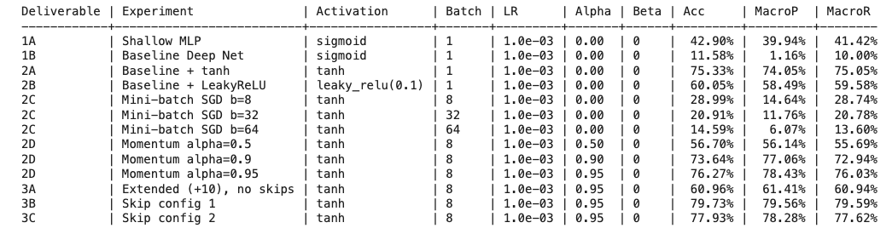
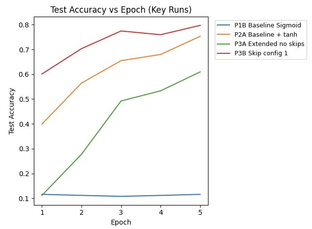

# Project 1: Satellite Land Cover Classification

This project builds a deep learning model to classify satellite images into different types of land cover (such as forests, rivers, highways, residential areas, etc.).

Using the EuroSAT dataset (27,000 satellite images across 10 categories), I explored how different training choices affect model performance — including activation functions, batch size, momentum, and skip connections in deeper networks.

The goal was not just to train a model, but to understand **what makes deep networks train well (or fail)**.

## Dataset

* **Dataset:** EuroSAT (via torchvision)
* **Images:** 27,000 RGB satellite images
* **Classes:** 10 land-cover categories
* **Resolution:** 64 × 64 pixels
* **Train/Test Split:** 70% / 30% (fixed seed for reproducibility)

The dataset is relatively balanced across classes, making it a good benchmark for multi-class classification.

## Procedure

I trained multiple models to understand how different training decisions affect learning:

* A simple shallow network (to check problem difficulty)
* A deeper convolutional network
* Different activation functions (Sigmoid, Tanh, LeakyReLU)
* Mini-batch training vs single-sample updates
* Momentum-based optimization
* A much deeper network (+10 layers)
* Skip connections (to improve gradient flow)
* Gradient magnitude tracking during the first training epoch

Instead of relying on built-in optimizers, I implemented the training updates manually to better understand the optimization process.

## Results Summary

The best model achieved:

* **79.73% Test Accuracy**
* **79.56% Macro Precision**
* **79.59% Macro Recall**

The best configuration used:

* **Tanh activation**
* **Momentum (α = 0.95)**
* **Skip connections in a deeper network**

## Training Behavior

The learning curves show a clear difference in stability:

* Networks using **Sigmoid** struggled to train and stayed near random performance.
* Switching to **Tanh** dramatically improved learning.
* Adding **momentum** stabilized training.
* Adding **skip connections** improved both convergence speed and final accuracy.

This highlights how optimization strategy can be just as important as model architecture.

## Implementation Details

To better understand training mechanics, I:

* Implemented softmax and cross-entropy manually
* Implemented manual SGD updates
* Reset gradients manually
* Avoided `torch.optim`

All experiments were run on CPU with a fixed random seed for reproducibility.

