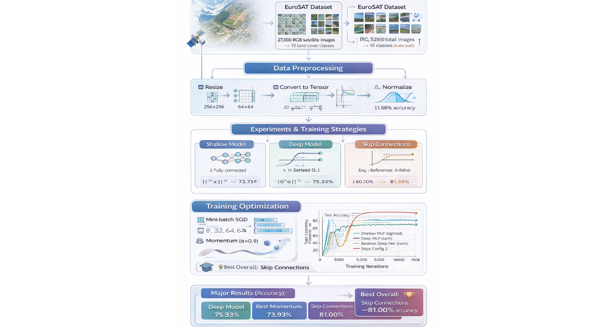

# Satellite Land Cover Classification using Deep Neural Networks

  

## Overview

This project focuses on classifying satellite images into different land cover categories such as forests, rivers, highways, and residential areas using deep neural networks.

Using the EuroSAT dataset, the goal was not only to build a high-performing model, but to understand how different design and training choices affect deep learning performance. In particular, the project explores how activation functions, optimization strategies, and architectural changes influence training stability and final accuracy.

## Dataset

The experiments are based on the EuroSAT dataset:

- 27,000 RGB satellite images  
- 10 land cover classes  
- Image resolution: 64 × 64  
- Train/Test split: 70% / 30% (fixed seed for reproducibility)  

The dataset is relatively balanced across classes, making it well-suited for multi-class classification tasks.

## Approach

The project was structured as a series of controlled experiments to understand how different components affect learning.

### Model Variations

- A shallow baseline network to establish problem difficulty  
- A deeper neural network for improved representation learning  
- A significantly deeper architecture (10+ layers)  

### Training Experiments

- Activation functions:
  - Sigmoid  
  - Tanh  
  - LeakyReLU  

- Optimization strategies:
  - Single-sample updates  
  - Mini-batch training  
  - Momentum-based optimization  

- Architectural improvements:
  - Skip connections to improve gradient flow  

### Implementation Focus

To better understand the training process, key components were implemented manually:

- Softmax and cross-entropy loss  
- Gradient computation and updates (SGD)  
- Manual parameter updates (without `torch.optim`)  

This allowed deeper visibility into how gradients behave during training.

## Results

The results showed that performance was driven more by training design than model size.

- A shallow model achieved ~43% accuracy, establishing baseline difficulty  
- Deep networks with sigmoid activation failed to train effectively (~11% accuracy)  
- Switching to tanh significantly improved performance (~75%)  
- Adding momentum stabilized training and improved convergence (~74%)  
- Introducing skip connections produced the best result (~81% accuracy)  

### Key Insight

The main limitation was not model capacity, but **gradient instability**.  
Changes that improved gradient flow (tanh, momentum, skip connections) had the largest impact on performance.

## Training Behavior

  

The training curves highlight clear differences between approaches:

- Sigmoid-based networks struggled to learn and remained near random performance  
- Tanh enabled faster and more stable convergence  
- Momentum reduced noise in updates  
- Skip connections improved both convergence speed and final accuracy  

## Performance Summary

  

Best model configuration:

- Test Accuracy: **~80%**  
- Macro Precision: ~79.5%  
- Macro Recall: ~79.6%  

Achieved using:

- Tanh activation  
- Momentum (α = 0.95)  
- Deep network with skip connections  

## Key Takeaways

- Deep models can fail even with sufficient capacity if gradients do not flow properly  
- Activation functions play a critical role in training stability  
- Optimization strategy (especially momentum) significantly impacts performance  
- Skip connections are highly effective in deeper architectures  
